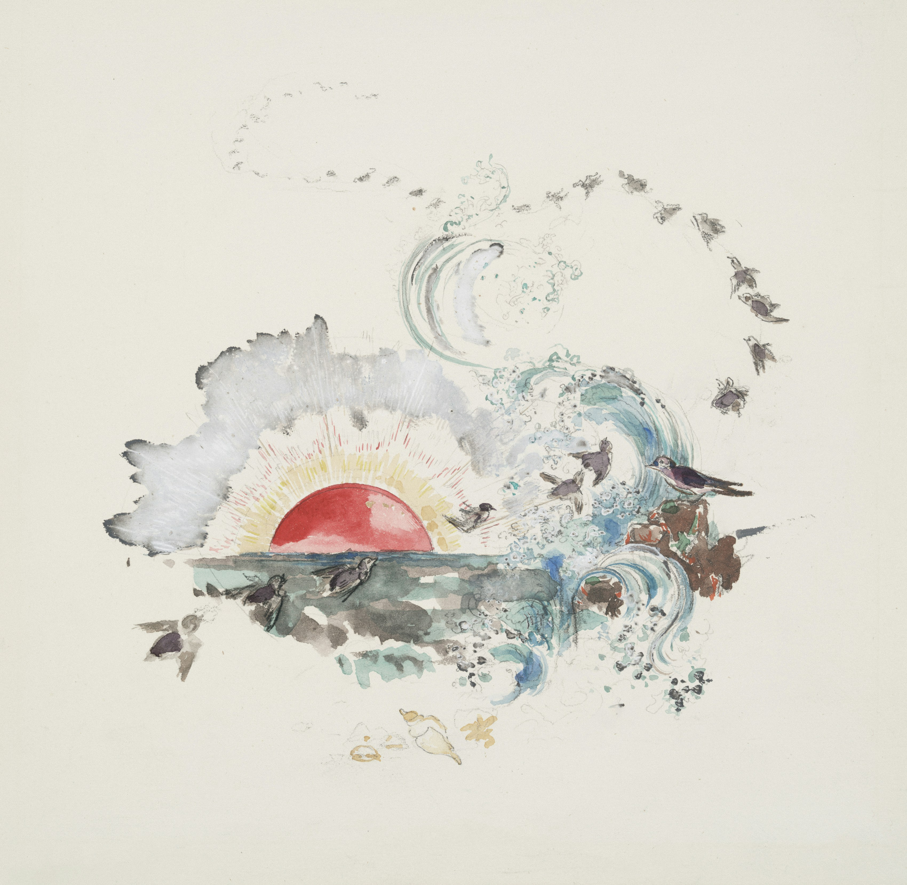

# 🌒 Dark Mode On

All slides use "class: invert"

---

# 📑 List Slide

- Item 1
- Item 2
- Item 3

---

# 📑📑 Two-column Lists

<div class="two-columns">
  <ul><li>🍎 Apple</li><li>🍌 Banana</li><li>🍇 Grapes</li></ul>
  <ul><li>🥦 Broccoli</li><li>🥕 Carrot</li><li>🌽 Corn</li></ul>
</div>

---

# 🖼️ Image + Caption

<div class="centered-img-wrapper">
  
  <div class="caption">A calm sunset 🌇</div>
</div>

---

# 🎬 Embedded Video

<div class="video-wrapper">
  <iframe
    class="video-embed"
    width="560"
    height="315"
    src="https://www.youtube.com/embed/6-i4Dt-QI9Y?si=opp_1gijkun0OOdq"
    title="YouTube video player"
    frameborder="0"
    allow="accelerometer; autoplay; clipboard-write; encrypted-media; gyroscope; picture-in-picture; web-share"
    referrerpolicy="strict-origin-when-cross-origin"
    allowfullscreen
  ></iframe>
</div>

---

# 💻 Code Example

```js
function quicksort(arr) {
  if (arr.length <= 1) return arr;

  const pivot = arr[arr.length >> 1];
  const left = [],
    right = [],
    equal = [];

  for (const x of arr) {
    if (x < pivot) left.push(x);
    else if (x > pivot) right.push(x);
    else equal.push(x);
  }

  return [...quicksort(left), ...equal, ...quicksort(right)];
}
```

---

# 🔗 Links

- [Marp Official Site](https://marp.app)
- [YouTube Video Link](https://www.youtube.com/watch?v=6-i4Dt-QI9Y)
- [GitHub Repo](https://github.com/marp-team/marp-cli)

---

# 🎞️ GIF


<div class="caption">Just a quick laugh!</div>

---

# 🎉 Lots of text!

<div class="scroll-text">
Lorem ipsum dolor sit amet, consectetur adipiscing elit. Morbi dictum ex et massa rutrum condimentum. Aliquam erat volutpat. Sed ut lectus urna. Sed pulvinar interdum dui eu aliquet. Ut eros massa, dictum eget venenatis malesuada, sollicitudin eget ipsum. Nam convallis nibh nulla, at rhoncus sem hendrerit ut. Suspendisse condimentum, ante id consequat efficitur, quam felis egestas lorem, sed fermentum dolor justo sed metus. Vestibulum vitae facilisis tellus. Proin imperdiet leo tellus, eu feugiat quam viverra id. Praesent sed odio augue. Integer id fermentum turpis. Integer ut elit vel mauris convallis vestibulum. Etiam tellus mauris, sagittis quis nibh faucibus, viverra scelerisque erat. Quisque accumsan quam nec urna maximus, vel ultricies augue efficitur.

Nunc vel faucibus tortor. Phasellus lobortis purus purus, quis feugiat elit venenatis eget. Nunc et risus a tellus efficitur venenatis a nec neque. Etiam sed enim arcu. Pellentesque habitant morbi tristique senectus et netus et malesuada fames ac turpis egestas. Mauris commodo commodo tellus nec mollis. Vestibulum molestie vestibulum libero, ac posuere tellus porttitor a. Sed a neque ullamcorper, ultrices nisl sit amet, rutrum lorem. Proin vel hendrerit felis. Aliquam porttitor a nulla ut viverra. Donec viverra orci non enim fringilla, et tempus magna rhoncus. Donec eget tortor ut urna vehicula semper. Nam cursus elementum aliquet. Integer sollicitudin erat eu risus lobortis, ac lobortis mauris ultrices.

Quisque non libero augue. Donec id lorem sagittis, vulputate neque sed, cursus lacus. Etiam porta convallis nibh, id gravida nulla dapibus id. Ut varius malesuada neque nec imperdiet. Maecenas in lacinia neque. Nulla diam arcu, fringilla sed nunc vitae, placerat ornare diam. Quisque rhoncus ante est, quis vulputate ligula porttitor ac. Morbi malesuada porta arcu ac tristique. Aliquam erat volutpat. Aenean rhoncus accumsan ultrices.

Phasellus nec dui sagittis, tincidunt ligula at, blandit tellus. Vestibulum ante ipsum primis in faucibus orci luctus et ultrices posuere cubilia curae; Mauris posuere erat a odio consequat, vestibulum dapibus tortor aliquet. Phasellus justo sem, egestas eget ex eget, dapibus iaculis diam. Lorem ipsum dolor sit amet, consectetur adipiscing elit. Praesent nec mauris mollis, elementum turpis nec, dapibus augue. Proin sodales feugiat dictum. Aliquam eu leo ut justo auctor suscipit nec sit amet lacus. Pellentesque at diam vel enim feugiat viverra. Phasellus volutpat, leo ut facilisis consectetur, nisi arcu fringilla dui, quis scelerisque diam felis in quam. Donec dictum viverra efficitur. Proin tempor ultricies ante, vitae placerat lectus dictum eu.

Nullam vel mauris quis mauris aliquam tincidunt. Aenean et ante sed risus tempus faucibus. Quisque orci augue, elementum sed venenatis vitae, sodales quis risus. Curabitur pretium fermentum aliquet. Sed varius risus non magna ornare, a laoreet augue elementum. Sed vulputate sem eget accumsan venenatis. Ut diam tortor, tempus sit amet lobortis sed, mattis id dolor. Etiam id consectetur nunc. Nunc consectetur nunc id massa faucibus consequat. Pellentesque ac tincidunt magna. In massa nunc, mollis eget sem vel, tempor fermentum enim.

</div>

---

# 📦️ Compiling to html

```bash
npx marp slides.md --html -o slides.html
```
